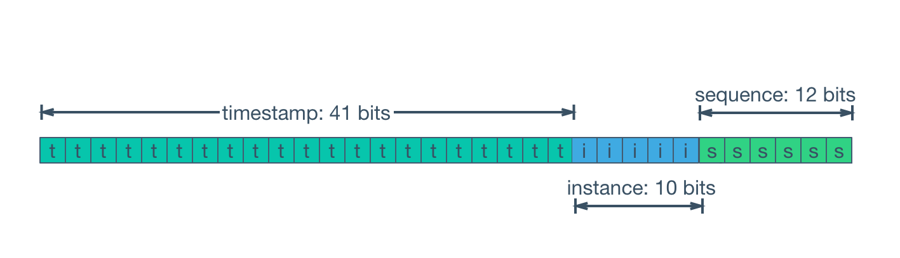

# k-Snowflake

---

Simple zero-dependency implementation of Twitter`s (X) snowflake in rust. Firstly used for my projects

> Twitter snowflake schema



Snowflakes are 64 bits in binary. (Only 63 are used to fit in a signed integer.) The first 41 bits are a timestamp, representing milliseconds since the chosen epoch (default X epoch is 1288834974657 (in Unix time milliseconds)) . The next 10 bits represent a machine ID, preventing clashes. Twelve more bits represent a per-machine sequence number, to allow creation of multiple snowflakes in the same millisecond. The final number is generally serialized in decimal

## Basic usage
```rust
use k_snowflake::Snowflake;

fn main() {
    // Create snowflake
    let snowflake = Snowflake::new(123, 123);

    // convert to decimal
    let decimal_snowflake = snowflake.to_decimal().unwrap();

    // supports display
    println!("{}", snowflake);
}
```

See other methods in docs