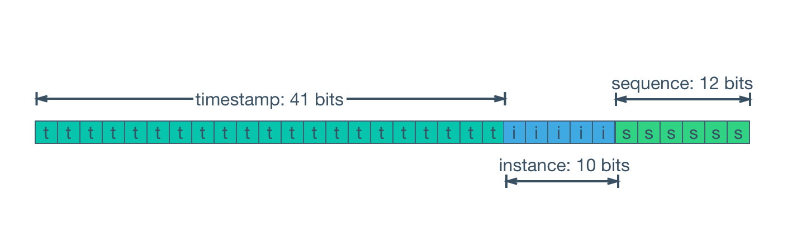

# k-snowflake

---

Simple one-dependency implementation of Twitter`s (X) snowflake in rust. Compatible with discord snowflakes. Firstly used for my projects.
One snowflake creation take ~52ns. See /benches.

> Twitter snowflake schema



Snowflakes are 64 bits in binary. (Only 63 are used to fit in a signed integer.) The first 41 bits are a timestamp, representing milliseconds since the chosen epoch (default X epoch is 1288834974657 (in Unix time milliseconds)) . The next 10 bits represent a machine ID, preventing clashes. Twelve more bits represent a per-machine sequence number, to allow creation of multiple snowflakes in the same millisecond. The final number is generally serialized in decimal

## Version 2 changelog
- Added global context to handle epoch, instance and sequence
- Updated methods of Snowflake
- New simple use function create_snowflake()
- Config functions like set_epoch() and etc.

## Basic usage
```rust
use k_snowflake::{create_snowflake, set_epoch, Snowflake, DISCORD_EPOCH};

fn main() {
    // Create snowflake
    let snowflake = create_snowflake();
    println!("{}", snowflake);

    // change epoch
    set_epoch(DISCORD_EPOCH);
    let snowflake = create_snowflake();
    println!("{}", snowflake);

    // get UNIX timestamp of discord snowflake
    println!(
        "{}",
        "1301619246953926811"
            .parse::<Snowflake>()
            .unwrap()
            .get_unix_timestamp()
    );
}

```

See other methods in docs